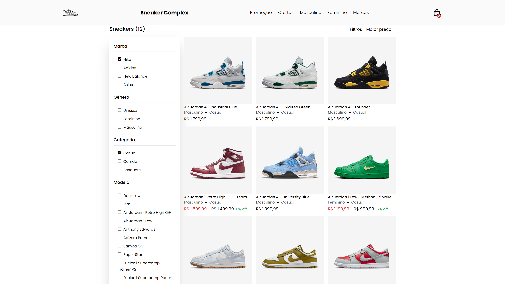
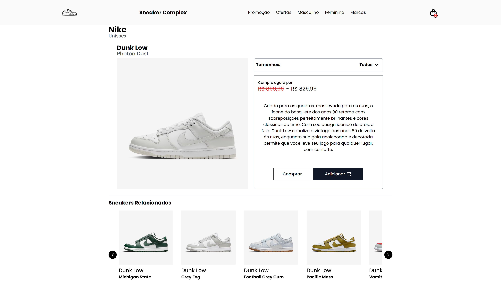
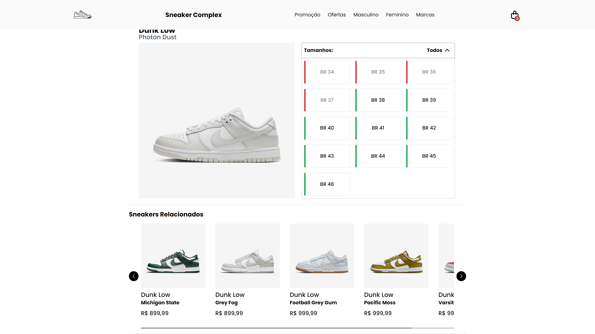
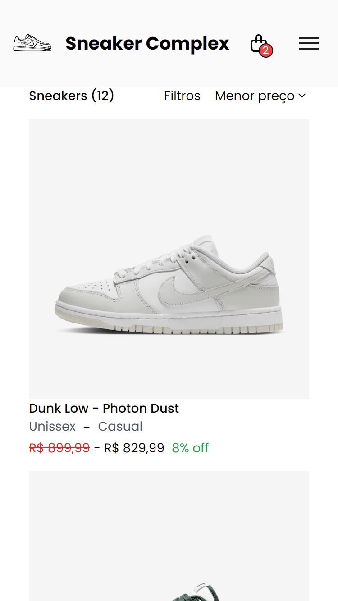
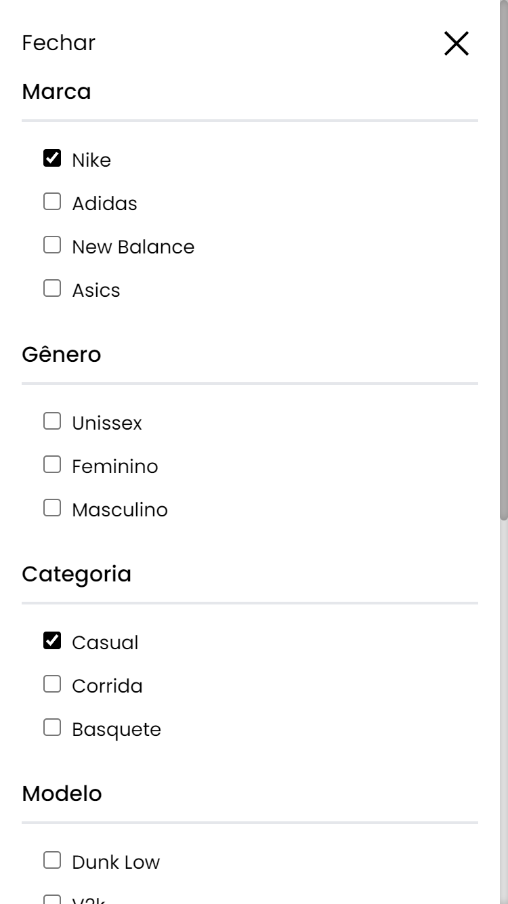
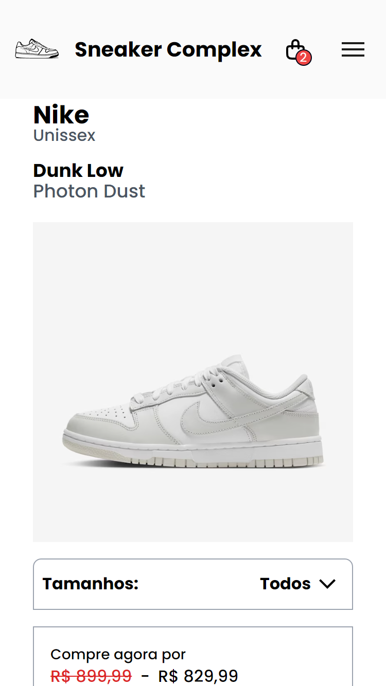
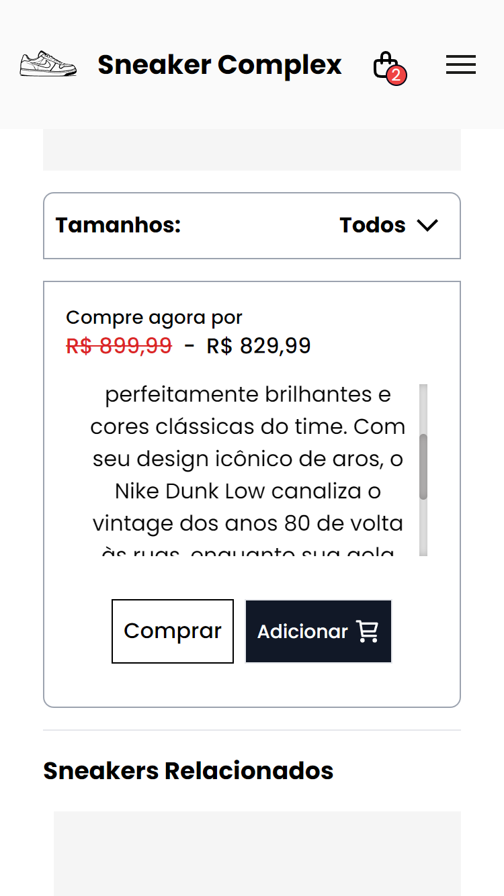

# Sneakers Complex

## Description

Sneakers Complex is a web application for sneaker enthusiasts and shoppers. The platform offers a wide range of sneakers, from popular mainstream brands to exclusive limited editions. The project aims to provide a seamless and engaging shopping experience with an intuitive user interface.

## Technologies

- React: For building the user interface.
- Tailwind: For styling the application.
- json-server: For storage data.

## Features

### Home

- Promotional Banners.
- Shoes Highlight by Brand.
- Navbar item dropdown menu.
- Side bar menu with history (mobile only).

### Shoe Page

- Shoes information: description, price and discounted prices.
- Available Sizes.
- Related shoes carrousel.

### Offers Page

- Filters: Gender, Brand, Category, Model.
- Sort: Release Date, Highest and Lowest Price.
- Items pagination.

### Cart

- Increse, decrease and Delete items.
- localStorage to persist items in cart.

## Screenshots

## Desktop

### Home

### Navbar Dropdown Item

### Shopping Cart

### Offer Page

### Shoe Page

### Shoe Sizes Available

## Mobile

### Home

### Menu

### Offer Page

### Filters

### Shoe Page

